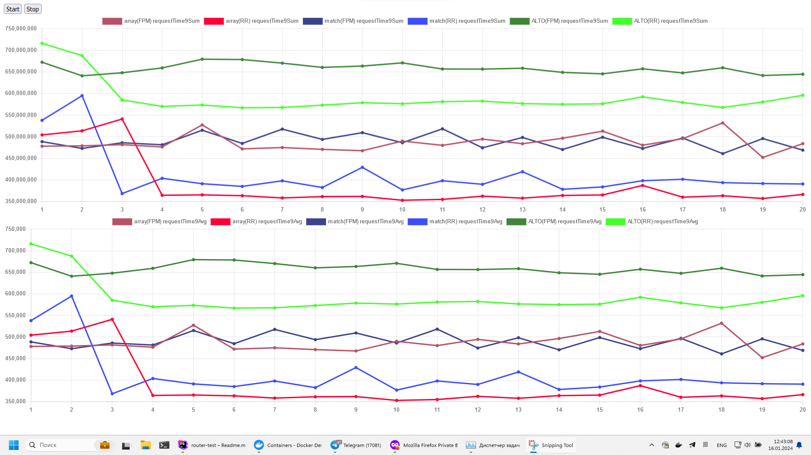

## Результат тестов

Запущено в докере `make up`
* Ноутбук 
* Процессор: 13th Gen Intel(R) Core(TM) i9-13980HX   2.40 GHz
* ОЗУ: 16,0 ГБ

## Запуск тестов локально

Для начала запустить `make up`

Открыть http://localhost:8080/index.php и нажать кнопку `Start`

На 8080 порту - FPM.  На 8081 порту - RoadRunner.

Через фаил test.http можно проверять запросы

Графики отсюда - https://www.chartjs.org/docs/latest/configuration/

ООП библиотека для роутинга - https://github.com/dannyvankooten/AltoRouter

FPM Memory test#1 - 2097152
FPM Memory test#2 - 2097152
FPM Memory test#3 - 2118124

RR Memory test#1 - 2097152
RR Memory test#2 - 2097152
RR Memory test#3 - 4194304

